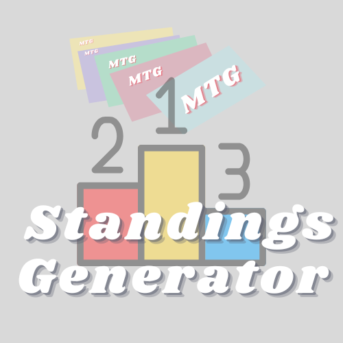
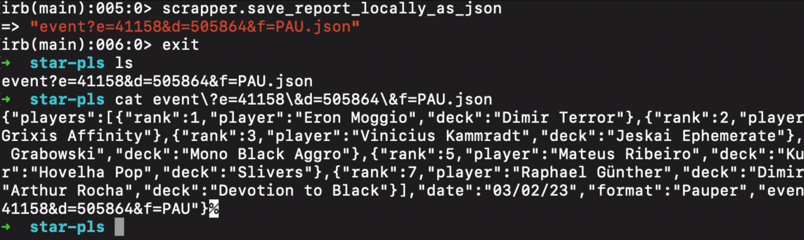
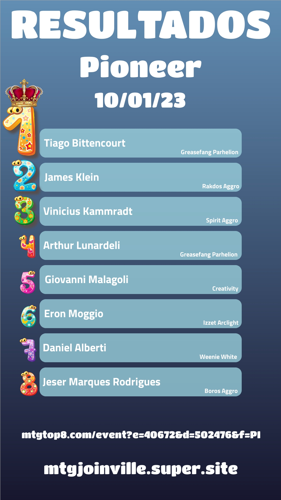
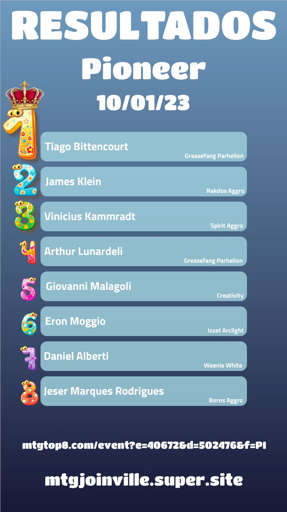

<h1 align="center">Welcome to MTG Standings Generator 👋</h1>


<div align="center">
    
</div>

<p>
  
  <a href="https://twitter.com/kammzinho" target="_blank">
    
  </a>
</p>

> Generate visuals and medias for standings with MTGTop8 Scrapper and RenderForm.


## How it looks

### Convert this:



### Into this:




### Demo


https://user-images.githubusercontent.com/34798570/221459941-5337a04b-6a6f-451e-9a70-0bbe5ae10b88.mov


## How it works?
1. 🛠 Scrape data from mtgtop8.com with [MTGTop8 Scrapper](https://github.com/kammradt/mtgtop8-scrapper)
2. 💹 Create a template at [https://renderform.io/](https://renderform.io/)
3. 🌐 Use their API to send the data
4. 🎨 Get cool images 😎

## Why?
- 🥹 Mixing coding and Magic 💛
- 🎆 With a report from [MTGTop8 Scrapper](https://github.com/kammradt/mtgtop8-scrapper), I can create standings in seconds ready to be shared around     
- 📈 No manual work needed around, just the links and then ✨ MAGIC ✨ (literally).  

### The current ecosystem

- [MTG Joinville Website](https://mtgjoinville.super.site/)
  - 😉 Entrypoint for a bunch of information related to Magic in our city 
- [MTGTop8 Scrapper](https://github.com/kammradt/mtgtop8-scrapper)
  - 🪓 Will gather data from the main website that holds results from many tournaments
- [MTG Standings Generator](https://github.com/kammradt/mtg-standings-generator)
  - Use reports from [MTGTop8 Scrapper](https://github.com/kammradt/mtgtop8-scrapper) to build social media ready images showing top 8 players and their decks. 
  - This is currently being used in our [MTG Joinville Website](https://mtgjoinville.super.site/) 🙏🏻.
  - <details>

      <summary>Some image examples</summary>

      
      
    </details>

## Install
> None of the builds/versions will probably be stable. This is a kind of pet project, so use at your own risk.

```sh
# This gem is required to get data and then turn it into images
gem install mtgtop8_scrapper
gem install dotenv
```

## Usage
> I followed this [really good tutorial that they have](https://renderform.io/blog/posts/how-to-create-many-images-from-spreadsheet/), just changing this according to my needs. 

1. Create an account at [RenderForm](https://renderform.io/)
2. Create a template with your favorite visuals
3. Don't forget to give each element an unique name, so we can pass/fill information with the api referencing those fields
4. Grab your Template ID
    1. Create and fill an .env with RENDER_FORM_TEMPLATE_ID=your-template-id
5. Grab your API key
   1. fill the .env with RENDER_FORM_API_KEY=your-api-kley

> Now, feel free to copy the code from the app.rb file or look at it below.  
> Also, feel free to verify lib/render_form.rb and change as you prefer ❣️
> 

```ruby
# frozen_string_literal: true

require 'mtgtop8_scrapper'
require 'json'
require_relative 'lib/render_form'

links = [
  'https://www.mtgtop8.com/event?e=40672&d=502476&f=PI'
]

reports = links.map do |link|
  scrapper = MTGTop8Scrapper.new(link)
  scrapper.generate_report

  scrapper.report
end

reports.each do |report|
  response = RenderForm.new(report).generate_image
  if response.is_a? Net::HTTPSuccess
    link = JSON.parse(response.body)['href']

    puts 'Enjoy your amazing image! ✨✨✨'
    puts link
  else
    puts 'Ouuupppss, something wrong happened! Check the error!'
    puts response.message
  end
end
```


## Author

👤 **Vinícius Kammradt**

* Website: https://kammradt.super.site
* Twitter: [@kammzinho](https://twitter.com/kammzinho)
* Github: [@kammradt](https://github.com/kammradt)
* LinkedIn: [@vinicius-kammradt](https://linkedin.com/in/vinicius-kammradt)

## Show your support

Give a ⭐️ if this project helped you!
